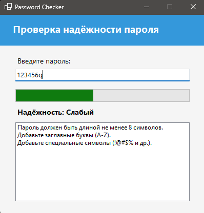

# PasswordChecker (WinForm)
---
- Приложение которое оценивает надежность пароля и дает рекомендации по улучшению
---
- An application that evaluates password strength and provides recommendations for improvement
---
## О приложении:
- Проверка пароля в реальном времени  
- Визуальная шкала
- Оценка надежности:  
  **Очень слабый → Слабый → Хороший → Очень хороший**  
- Подсказки по улучшению пароля  
- Минималистичный интерфейс
---
## About the app:
- Real-time password verification  
- Visual scale
- Reliability rating:
**Very weak → Weak → Good → Very good**  
- Tips for password improvement  
- Minimalistic interface
---
## Как считается надежность
Приложение анализирует:
- длину пароля (8+ символов)  
- наличие строчных букв  
- наличие заглавных букв  
- наличие цифр  
- наличие специальных символов  
- разнообразие символов (уникальность)

- Каждый критерий добавляет баллы к итоговой оценке
---
## How reliability is considered
The application analyzes:
- password length (8+ characters)  
- the presence of lowercase letters  
- the presence of capital letters  
- the presence of numbers  
- the presence of special characters  
- a variety of symbols (uniqueness)

- Each criterion adds points to the final score
---

---
